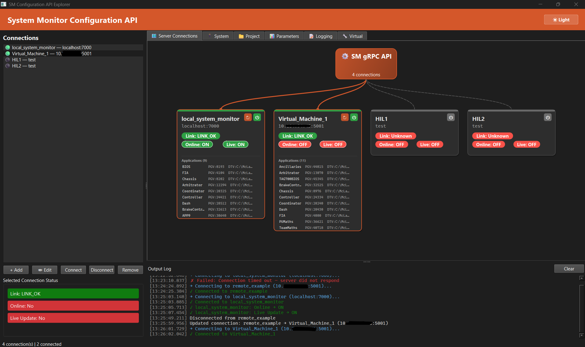

# System Monitor Configuration API -- Python Client

A Python wrapper library for the Motion Applied **System Monitor Configuration gRPC API**, providing programmatic access to System Monitor instances for configuration management, parameter read/write, data logging control, and virtual parameter management.

This library exposes all five gRPC services (201 RPCs total) through a clean, Pythonic interface with automatic TLS negotiation, connection lifecycle management, and structured error handling.

Available from System Monitor version **8.85** onwards.


## Table of Contents

- [Requirements](#requirements)
- [Installation](#installation)
- [Project Structure](#project-structure)
- [Quick Start](#quick-start)
- [Connection Modes](#connection-modes)
- [Service Overview](#service-overview)
- [Desktop GUI](#desktop-gui)
- [Testing](#testing)
- [Documentation](#documentation)
- [References](#references)


## Requirements

- Python 3.10 or later
- A running System Monitor instance (v8.85+) with the Configuration API enabled
- Network connectivity to the System Monitor host on the configured API port (default: 7000)


## Installation

```bash
# Clone the repository
git clone <repository-url>
cd SystemMonitor_Configuration_API

# Create and activate a virtual environment
python -m venv .venv
.venv\Scripts\activate        # Windows
source .venv/bin/activate     # Linux / macOS

# Install the package in development mode
pip install -e ".[dev]"

# Generate gRPC stubs from proto definitions
python scripts/generate_protos.py
```


## Project Structure

```
SystemMonitor_Configuration_API/
    protos/                          Proto definitions (6 files)
        system_monitor_common.proto      Shared message types and enums
        system_monitor_system.proto      System service definition
        system_monitor_project.proto     Project service definition
        system_monitor_parameter.proto   Parameter service definition
        system_monitor_logging.proto     Logging service definition
        system_monitor_virtual.proto     Virtual parameter service definition
    sm_config_api/                   Python library
        generated/                       Auto-generated gRPC stubs (18 files)
        services/                        Service wrappers
            system.py                        SystemService (19 RPCs)
            project.py                       ProjectService (85 RPCs)
            parameter.py                     ParameterService (60 RPCs)
            logging_svc.py                   LoggingService (22 RPCs)
            virtual.py                       VirtualService (15 RPCs)
            base.py                          Base class with error handling
        client.py                        SystemMonitorClient facade
        connection.py                    Connection configuration and channel management
        enums.py                         Protocol enumerations (14 IntEnum classes)
        errors.py                        Exception hierarchy (40+ error types)
    gui/                             PySide6 desktop application
        main.py                          Main window and tab panels
        topology.py                      Live topology diagram (draggable cards)
        connection_manager.py            Multi-connection store with persistence
        workers.py                       Background thread utilities
    scripts/
        generate_protos.py               Proto compilation and import fixing
        smoke_test.py                    Quick connectivity test
    tests/                           Test suite (52 tests)
    run_gui.py                       GUI launcher
    pyproject.toml                   Package metadata and dependencies
```


## Quick Start

```python
from sm_config_api import SystemMonitorClient, ConnectionConfig

# TLS connection with automatic certificate probing
config = ConnectionConfig(address="localhost:7000")

with SystemMonitorClient(config) as client:
    # System status
    status = client.system.get_status()
    print(f"Online: {status.online}, Live Update: {status.live_update}")

    # List applications
    apps = client.project.get_app_details()
    for app in apps.app_details:
        print(f"  {app.app_id}: {app.app_name}")

    # Read parameter values
    values = client.parameter.get_value_scalar(app_id=3840, parameter_ids=["nEngine"])
    for v in values.parameter_values:
        print(f"  {v.parameter_id} = {v.value}")
```


## Connection Modes

The library supports multiple connection modes:

**1. TLS with automatic certificate probing (recommended)**

```python
# Local instance
config = ConnectionConfig(address="localhost:7000")

# Remote instance -- auto-probing handles CN mismatch transparently
config = ConnectionConfig(address="10.0.0.50:5001")
```

The library automatically retrieves the server's TLS certificate, extracts the Common Name, and configures hostname verification accordingly. This works with self-signed certificates (CN=localhost), custom PFX certificates, and CA-signed certificates. No certificate files are needed on the client side.

**2. TLS with explicit certificates (PFX/PKCS#12 or PEM)**

```python
# PFX certificate (compatible with C# sample client settings.json)
config = ConnectionConfig(
    address="hostname:7000",
    pfx_path="path/to/client.pfx",
    pfx_password="password",
    ca_cert="path/to/ca.pem",
)

# PEM certificates
config = ConnectionConfig(
    address="hostname:7000",
    client_cert="path/to/client.pem",
    client_key="path/to/client-key.pem",
    ca_cert="path/to/ca.pem",
)
```

When providing certificates explicitly for a remote host with a CN mismatch, add the hostname override:

```python
config = ConnectionConfig(
    address="10.0.0.50:7000",
    ca_cert="path/to/server-cert.pem",
    options=[("grpc.ssl_target_name_override", "localhost")],
)
```

**3. TLS with OAuth2 bearer tokens**

```python
config = ConnectionConfig(
    address="hostname:7000",
    ca_cert="path/to/ca.pem",
    use_token=True,
    client_id="my-client-id",
    client_secret="my-client-secret",
    token_uri="https://auth-server/oauth/token",
    audience="system-monitor-api",
)
```

**4. Insecure (plaintext, local development only)**

```python
config = ConnectionConfig(address="localhost:7000", insecure=True)
```

Configurations can also be loaded from the C# sample client settings.json format:

```python
config = ConnectionConfig.from_json("settings.json")
```


## Service Overview

| Service            | Methods | Description                                          |
|--------------------|---------|------------------------------------------------------|
| `SystemService`    | 19      | Connection status, unit info, licence, device properties |
| `ProjectService`   | 85      | Applications, DTV/PGV versions, errors, events, files |
| `ParameterService` | 60      | Parameter listing, values, conversions, calibrations |
| `LoggingService`   | 22      | Logging channels, triggers, configuration            |
| `VirtualService`   | 15      | Virtual parameter creation and management            |

All services are accessed through the `SystemMonitorClient` facade:

```python
client.system.get_status()
client.project.get_app_details()
client.parameter.get_parameters(app_id=3840, parameter_type=0)
client.logging.get_logging_config()
client.virtual.get_virtual_parameters(app_id=3840)
```


## Desktop GUI

A PySide6 desktop application is included for interactive use:

```bash
python run_gui.py
```

Features:

- Multi-connection manager with JSON persistence
- Real-time status polling (Link, Online, Live Update) every 2 seconds
- Live topology diagram with draggable connection cards
- Tabbed method panels for all five services
- Formatted output log with timing information
- Light and dark theme support


<p align="center">
  
</p>


## Testing

```bash
# Unit tests (no System Monitor required)
pytest tests/ -v

# Live integration tests (requires running System Monitor on localhost:7000)
SM_LIVE_TEST=1 pytest tests/test_live_integration.py -v

# Quick connectivity check
python scripts/smoke_test.py
python scripts/smoke_test.py --address 10.0.0.1:7000
```


## Documentation

For a detailed explanation of the Configuration API architecture, protocol design, and implementation walkthrough, refer to:

- [CONFIGURATION_API_GUIDE.md](CONFIGURATION_API_GUIDE.md) -- Comprehensive technical guide


## References

- [API Overview](https://atlas.motionapplied.com/developer-resources/system-monitor/configuration_api/)
- [Proto Reference](https://atlas.motionapplied.com/developer-resources/system-monitor/configuration_api/docs/)
- [NuGet Package (proto source)](https://github.com/mat-docs/packages/pkgs/nuget/SystemMonitorConfigurationAPI) -- requires Motion Applied SSO
- [C# Sample Client](https://github.com/mat-docs/System.Monitor.Configuration.API.Client.Sample)
